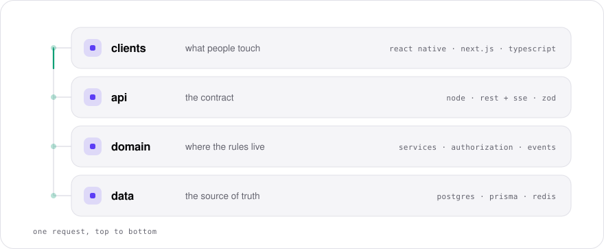

<picture>
  <source media="(prefers-color-scheme: dark)" srcset="assets/hero-dark.svg">
  <source media="(prefers-color-scheme: light)" srcset="assets/hero-light.svg">
  
</picture>

<picture>
  <source media="(prefers-color-scheme: dark)" srcset="assets/stack-dark.svg">
  <source media="(prefers-color-scheme: light)" srcset="assets/stack-light.svg">
  
</picture>

Mobile and web on one shared service layer, and considerably more real-time work than I planned for.

**[jadjbara.com](https://jadjbara.com)**  ·  [jado.jbara@gmail.com](mailto:jado.jbara@gmail.com)

Both panels are hand-written SVG animated with CSS — <a href="tools/build-assets.mjs"><code>tools/build-assets.mjs</code></a> builds light and dark from one source.
